  

  
  
  

  

I build backend systems and AI infrastructure. At Arizona State I shipped **TutorBot**, a production RAG platform that grounds an LLM in actual course material for **10,000+ students**. Outside of class I run **[DevToolie](https://github.com/DevToolie)**, where I make tools for developers and AI agents.

|   |   |
|---|---|
| 🎓 **Studying** | MS Computer Science @ Arizona State University (GPA 4.0) · BS CS '26 (GPA 3.7) |
| 🛠️ **Building** | [Flecto](https://github.com/myselfsiddharth/Flecto) · [Paragent](https://github.com/DevToolie/Paragent) · [LegalAI](https://github.com/myselfsiddharth/LegalAI) |
| 💼 **Before** | Software Developer @ ASU · Software Engineer Intern @ Sahy Techpreneurs (Stripe rebuild, flat files → PostgreSQL) |
| 🤝 **Leading** | VP of AI Society · Executive Advisor, AWS Cloud Builders Club |
| 🌱 **Open source** | Fixes in [microsoft/vscode](https://github.com/microsoft/vscode), one merged, one in review |
| 💬 **Ask me about** | RAG, browser agents, AWS, Terraform/Kubernetes review, backend design |

  

  

  

<table>
  <tr>
    <td width="50%"></td>
    <td width="50%"></td>
  </tr>
  <tr>
    <td width="50%"></td>
    <td width="50%"></td>
  </tr>
</table>

<b>More projects</b>

 

| Project | What it is |
|---|---|
| [Decentralized Escrow System](https://github.com/myselfsiddharth/Decentralized-Smart-Contract-Based-Escrow-System) | Solidity smart contracts for trust-minimized escrow |
| [Phishing Detection with RNNs](https://github.com/myselfsiddharth/RNN-Based-Phishing-Email-Detection-Using-LSTM-GRU-and-BiRNN) | LSTM, GRU and BiRNN compared across 82,077 emails |
| [Game Distribution Website](https://github.com/myselfsiddharth/Game-Distribution-Website) | Django-based game distribution platform |
| [California Housing Prediction](https://github.com/myselfsiddharth/California-Housing-Price-Prediction) | Random Forest regression on housing data |
| [Flecto Terraform demo](https://github.com/myselfsiddharth/flecto-example-terraform) | Live demo of Flecto reviewing a Terraform plan on a PR |

More write-ups (taxi graph pipeline, wildfire digital twin, facial emotion CNN) live on [siddharth.wiki](https://siddharth.wiki).

  

  

  

📄 *Constrained GA Optimized Super Twisting Sliding Mode Controller for 2-DoF Robotic Arm*, **2025 IEEE Region 10 Conference (TENCON)**

  

  

  
  
  

  

